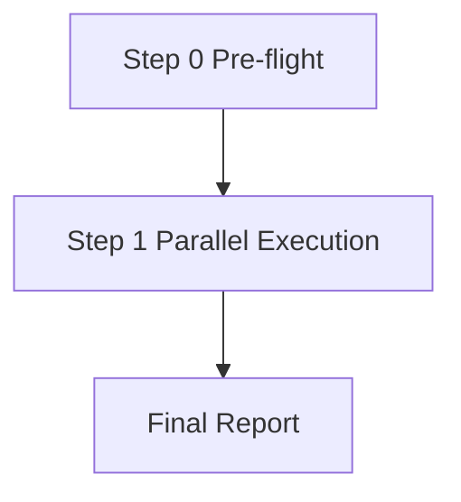

# Workflow: Dev-Test Parallel Team

## Flowchart



## Step 0: Pre-flight Dependency Check

- **Executor**: leader
- **Action**: Read [dependencies.yaml](dependencies.yaml), verify python3 availability
- **Output**: Report dependency status; terminate if python3 is missing (required: true)
- **Quality Gate**: python3 available, user confirms to continue

## Step 1: Parallel Execution

- **Executor**: developer + tester (parallel spawn)
- **Input**: User feature description
- **Output**:
  - developer → `.team/reports/T1_developer.md`
  - tester → `.team/reports/T2_tester.md`
- **Visibility**: developer and tester are invisible to each other (parallel decomposition pattern)
- **Quality Gate**: Both files exist and contain complete code blocks

## Final Report

leader consolidates both outputs into `.team/reports/T3_final_report.md` using **verbatim quoting**:

```markdown
# Dev-Test Parallel Team Final Report

## Developer Output
<Verbatim quote of .team/reports/T1_developer.md content>

## Test Engineer Output
<Verbatim quote of .team/reports/T2_tester.md content>

## Consolidation Notes
- Correspondence between code and tests
- Suggested next steps (e.g., run tests, fix failing cases)
```
