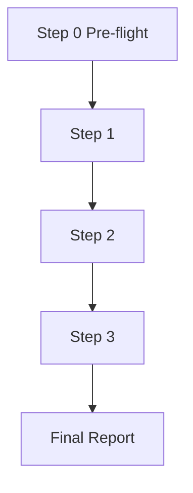

# Workflow: <Team Name>

## Flowchart



## Step 0: Pre-flight Dependency Check

- **Executor**: leader
- **Action**: Read dependencies.yaml, verify dependency availability
- **Output**: Report missing items; terminate if required=true is missing, degrade if required=false is missing
- **Quality Gate**: User confirms whether to continue

## Step 1: <Step Name>

- **Executor**: <leader / role-name>
- **Input**: <input source>
- **Output**: <output file path>
- **Quality Gate**: <completion verification criteria>

## Step 2: <Step Name>

- **Executor**: <role-name>
- **Input**: <upstream output / user input>
- **Output**: <output file path>
- **Quality Gate**: <completion verification criteria>

## Final Report

leader consolidates all intermediate reports into `.team/reports/T<last>_final_report.md` using **verbatim quoting**, template:

```markdown
# <Team Name> Final Report

## Original Outputs from Each Role

### <role-1> Report
<Verbatim quote of .team/reports/T*_*.md content>

### <role-2> Report
<Verbatim quote>
```
