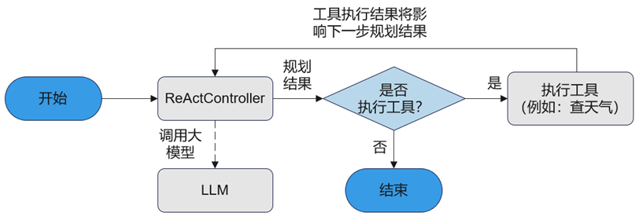

本章节演示了如何基于openJiuwen构建一个用于天气查询的`ReActAgent`应用，该应用支持通过ReAct规划模式引导大模型生成插件调用命令，进而结合插件执行结果生成最终答案。通过示例，你将会了解到如下信息：

- 如何创建提示词。
- 如何使用插件模块。
- 如何配置MCP扩展插件。
- 如何创建和执行`ReActAgent`。

# 应用设计流程

`ReActAgent`是一种遵循ReAct（Reasoning + Action）规划模式的Agent，通过 "思考（Thought）→ 行动（Action）→ 观察（Observe）"的循环迭代完成用户任务。

1. 思考：`ReActController`调用LLM进行任务规划，解析 LLM 输出里是否包含工具执行指令。
2. 行动：根据思考中 LLM 的输出，分两种情况进行操作：
    - 有工具执行指令：调工具，选择并调用合适的工具（如检索、数据库、第三方API、代码执行等）执行具体的操作，本用例中是调用一个根据地点查询天气的工具；
    - 无工具执行指令：把LLM输出作为最终答案。
3. 观察：`ReActController`把工具返回的Observation追加到对话历史，再调用LLM进行下一次任务规划。

`ReActAgent`能根据工具执行结果观察与反馈，不断调整策略，优化推理路径，直至达成任务目标或获得最终答案。其强大的多轮推理与自我修正能力，使ReActAgent具备动态决策能力且能够灵活应对环境变化，适用于需要复杂推理和策略调整的多样化任务场景。
  
   <div align="center">
     
   </div>

# 前提条件

- **Java版本**: Java 21或更高版本
- **构建工具**: Maven 3.9+

使用前请检查Java版本信息：

```bash
java -version
```

# 安装openJiuwen

通过Maven将agent-core-java添加为依赖：

```xml
<dependency>
    <groupId>com.openjiuwen</groupId>
    <artifactId>agent-core-java</artifactId>
    <version>0.1.7</version>
</dependency>
```

# 创建提示词模板

创建系统提示词模板，用于设定`ReActAgent`的整体行为和角色定位。以下系统提示词定义了人设、任务目标和约束限制，帮助`ReActAgent`在与用户交互时正确理解任务目标。

```java
private static final String SYSTEM_PROMPT = "你是一个天气查询助手。"
        + "当用户询问天气时，必须先调用 WeatherReporter 工具获取天气信息，再基于工具结果总结回答。"
        + "工具会返回实时天气和未来几天预报。"
        + "每次只调用一次工具，不要重复调用。";
```

# 创建插件对象及其描述信息

本示例创建了天气查询插件，并定义了其输入参数的结构和要求。首先通过`RestfulApi`接口将天气查询服务封装成可以被框架使用的工具类。

> **注意**
> 本地测试请求服务（http 开头），可以通过配置相关的环境变量关闭SSL校验。但禁用SSL会跳过证书验证，可能遭遇数据篡改、中间人攻击，导致敏感信息泄露，仅允许测试环境临时使用，生产环境务必启用SSL校验保障安全。

```java
import com.openjiuwen.core.foundation.tool.Tool;
import com.openjiuwen.core.foundation.tool.service_api.RestfulApi;
import com.openjiuwen.core.foundation.tool.service_api.RestfulApiCard;
import java.util.Map;

private static Tool createWeatherTool(String weatherUrl) {
    RestfulApiCard card = RestfulApiCard.builder()
            .id("weather_tool")
            .name("WeatherReporter")
            .description("天气查询插件，输入 city 获取实时天气和未来几天预报；city 可传中文或英文城市名")
            .url(weatherUrl)
            .method("GET")
            .timeout(10.0)
            .queries(Map.of(
                "lang", "zh",
                "forecast", true
            ))
            .inputParams(Map.of(
                "type", "object",
                "properties", Map.of(
                    "city", Map.of(
                        "type", "string",
                        "description", "城市名称，支持中文（北京）和英文（Tokyo）",
                        "location", "query"
                    )
                )
            ))
            .build();

    return new RestfulApi(card);
}
```

## 配置MCP扩展插件

openJiuwen支持创建集成MCP（Model Context Protocol）扩展协议的插件。本示例提供了一个基于SSE协议的天气查询MCP插件的配置。

```java
import com.openjiuwen.core.foundation.tool.mcp.McpServerConfig;

private static McpServerConfig createMcpConfig() {
    return McpServerConfig.builder()
            .serverId("query_weather_mcp")
            .serverName("query_weather")
            .serverPath("http://127.0.0.1:8188/sse")
            .clientType("sse")
            .params(Map.of(
                "type", "object",
                "title", "query_weatherArguments",
                "properties", Map.of(
                    "location", Map.of(
                        "title", "Location",
                        "type", "string"
                    )
                ),
                "required", List.of("location")
            ))
            .build();
}
```

MCP服务器配置完成后，需要通过`Runner.resourceMgr()`注册：

```java
// 注册MCP服务器
Runner.resourceMgr().addMcpServer(mcpConfig, AGENT_ID, 600000.0);

// 将MCP工具卡片添加到Agent的能力管理器
agent.getAbilityManager().add(mcpToolCard);

// 使用完成后清理
Runner.resourceMgr().removeMcpServer(mcpConfig.getServerId(), null, null, true);
```

> **安全提示**
> 生产环境务必启用SSL校验和SSRF保护：
> - 设置环境变量 `RESTFUL_SSL_VERIFY=true`
> - 设置环境变量 `SSRF_PROTECT_ENABLED=true`

# 创建ReActAgent

首先使用`AgentCard`定义Agent的身份信息，然后使用`ReActAgentConfig`配置Agent的行为参数：

```java
import com.openjiuwen.core.singleagent.agents.ReActAgent;
import com.openjiuwen.core.singleagent.agents.ReActAgentConfig;
import com.openjiuwen.core.singleagent.schema.AgentCard;
import com.openjiuwen.core.foundation.llm.schema.ModelRequestConfig;
import java.util.List;
import java.util.Map;

private static ReActAgent createAgent() {
    // 创建Agent身份卡片
    AgentCard agentCard = AgentCard.builder()
            .id("react_agent_java_example")
            .name("react_agent_java_example")
            .description("天气查询助手")
            .build();

    // 创建ReActAgent实例
    ReActAgent agent = new ReActAgent(agentCard);
    
    // 配置Agent
    ReActAgentConfig config = ReActAgentConfig.builder()
            .promptTemplate(List.of(Map.of("role", "system", "content", SYSTEM_PROMPT)))
            .maxIterations(3)
            .build()
            .configureModelClient(
                    "your-model-provider",    // 模型提供商
                    "your-api-key",           // API密钥
                    "your-api-base",          // API基础URL
                    "your-model-name",        // 模型名称
                    true                      // SSL校验
            );

    // 配置模型请求参数
    ModelRequestConfig requestConfig = config.getModelConfigObj();
    requestConfig.setTemperature(0.6);
    requestConfig.setTopP(0.8);
    requestConfig.setMaxTokens(256);

    agent.configure(config);
    return agent;
}
```

## 注册工具到Agent

创建并注册天气查询工具到Agent：

```java
import com.openjiuwen.core.runner.Runner;
import com.openjiuwen.core.runner.base.TagMatchStrategy;

private static final String AGENT_ID = "react_agent_java_example";

private static void registerTool(ReActAgent agent, Tool tool) {
    // 移除已存在的同名工具
    Runner.resourceMgr().removeTool(tool.getCard().getId(), AGENT_ID, TagMatchStrategy.ALL, true);
    // 添加工具到资源管理器
    Runner.resourceMgr().addTool(tool, AGENT_ID);
    // 将工具添加到Agent的能力管理器
    agent.getAbilityManager().add(tool.getCard());
}
```

# 运行ReActAgent

创建完`ReActAgent`对象后，可以调用`Runner.runAgent`方法执行Agent：

```java
import com.openjiuwen.core.runner.Runner;
import java.util.Map;

public static void main(String[] args) throws Exception {
    Tool weatherTool = null;

    try {
        // 创建Agent和工具
        ReActAgent agent = createAgent();
        weatherTool = createWeatherTool("https://uapis.cn/api/v1/misc/weather");
        registerTool(agent, weatherTool);

        // 执行查询
        String query = "查询北京明天天气，并给出简短建议";
        Map<String, Object> result = (Map<String, Object>) Runner.runAgent(
                agent,
                Map.of(
                        "query", query,
                        "conversation_id", "react_agent_example_001"
                ),
                null,
                null
        );

        System.out.println("Agent result:");
        System.out.println(result);
    } finally {
        // 清理资源
        if (weatherTool != null) {
            Runner.resourceMgr().removeTool(weatherTool.getCard().getId(), AGENT_ID, TagMatchStrategy.ALL, true);
        }
        Runner.release("react_agent_example_001");
        Runner.stop();
    }
}
```

## 执行结果

查询成功后，会得到如下的结果：

```json
{
  "output": "北京明天天气晴朗，气温22-30℃，适合户外活动。建议穿着轻便透气的衣物，注意防晒。",
  "result_type": "answer"
}
```

# 完整示例代码

```java
package examples.reac_agent;

import com.openjiuwen.core.foundation.llm.schema.ModelRequestConfig;
import com.openjiuwen.core.foundation.tool.Tool;
import com.openjiuwen.core.foundation.tool.service_api.RestfulApi;
import com.openjiuwen.core.foundation.tool.service_api.RestfulApiCard;
import com.openjiuwen.core.runner.Runner;
import com.openjiuwen.core.runner.base.TagMatchStrategy;
import com.openjiuwen.core.singleagent.agents.ReActAgent;
import com.openjiuwen.core.singleagent.agents.ReActAgentConfig;
import com.openjiuwen.core.singleagent.schema.AgentCard;
import java.util.List;
import java.util.Map;

public class ReActWeatherAgentExample {
    private static final String AGENT_ID = "react_agent_java_example";
    private static final String SYSTEM_PROMPT = "你是一个天气查询助手。"
            + "当用户询问天气时，必须先调用 WeatherReporter 工具获取天气信息，再基于工具结果总结回答。"
            + "工具会返回实时天气和未来几天预报。"
            + "每次只调用一次工具，不要重复调用。";

    public static void main(String[] args) throws Exception {
        Tool weatherTool = null;

        try {
            ReActAgent agent = createAgent();
            weatherTool = createWeatherTool("https://uapis.cn/api/v1/misc/weather");
            registerTool(agent, weatherTool);

            String query = args.length == 0 ? "查询北京明天天气" : String.join(" ", args);
            Map<String, Object> result = (Map<String, Object>) Runner.runAgent(
                    agent,
                    Map.of("query", query, "conversation_id", "react_example_001"),
                    null, null
            );

            System.out.println("结果: " + result.get("output"));
        } finally {
            if (weatherTool != null) {
                Runner.resourceMgr().removeTool(weatherTool.getCard().getId(), AGENT_ID, TagMatchStrategy.ALL, true);
            }
            Runner.release("react_example_001");
            Runner.stop();
        }
    }

    private static ReActAgent createAgent() {
        AgentCard agentCard = AgentCard.builder()
                .id(AGENT_ID)
                .name(AGENT_ID)
                .description("天气查询助手")
                .build();

        ReActAgent agent = new ReActAgent(agentCard);
        ReActAgentConfig config = ReActAgentConfig.builder()
                .promptTemplate(List.of(Map.of("role", "system", "content", SYSTEM_PROMPT)))
                .maxIterations(3)
                .build()
                .configureModelClient("provider", "apiKey", "apiBase", "modelName", true);

        ModelRequestConfig requestConfig = config.getModelConfigObj();
        requestConfig.setTemperature(0.6);
        requestConfig.setTopP(0.8);
        requestConfig.setMaxTokens(256);

        agent.configure(config);
        return agent;
    }

    private static Tool createWeatherTool(String weatherUrl) {
        RestfulApiCard card = RestfulApiCard.builder()
                .id("weather_tool")
                .name("WeatherReporter")
                .description("天气查询插件，输入 city 获取实时天气")
                .url(weatherUrl)
                .method("GET")
                .timeout(10.0)
                .inputParams(Map.of(
                    "type", "object",
                    "properties", Map.of(
                        "city", Map.of("type", "string", "description", "城市名称")
                    )
                ))
                .build();
        return new RestfulApi(card);
    }

    private static void registerTool(ReActAgent agent, Tool tool) {
        Runner.resourceMgr().addTool(tool, AGENT_ID);
        agent.getAbilityManager().add(tool.getCard());
    }
}
```

> **注意**: 以上代码中的API配置信息（provider, apiKey, apiBase, modelName）需要替换为您实际的大模型服务配置。

# 使用MCP服务的完整示例

```java
package examples.reac_agent;

import com.openjiuwen.core.foundation.llm.schema.ModelRequestConfig;
import com.openjiuwen.core.foundation.tool.mcp.McpServerConfig;
import com.openjiuwen.core.runner.Runner;
import com.openjiuwen.core.runner.base.TagMatchStrategy;
import com.openjiuwen.core.singleagent.agents.ReActAgent;
import com.openjiuwen.core.singleagent.agents.ReActAgentConfig;
import com.openjiuwen.core.singleagent.schema.AgentCard;
import java.util.List;
import java.util.Map;

public class ReActMcpAgentExample {
    private static final String AGENT_ID = "react_mcp_agent_example";
    private static final String SYSTEM_PROMPT = "你是一个天气查询助手。"
            + "当用户询问天气时，必须先调用 query_weather 工具获取天气信息。"
            + "每次只调用一次工具。";

    public static void main(String[] args) throws Exception {
        ReActAgent agent = createAgent();
        McpServerConfig mcpConfig = createMcpConfig();

        try {
            // 注册MCP服务器
            Runner.resourceMgr().addMcpServer(mcpConfig, AGENT_ID, 600000.0);
            
            // 获取MCP工具卡片并添加到Agent
            // agent.getAbilityManager().add(mcpToolCard);

            String query = args.length == 0 ? "北京天气怎么样" : String.join(" ", args);
            Map<String, Object> result = (Map<String, Object>) Runner.runAgent(
                    agent,
                    Map.of("query", query, "conversation_id", "mcp_example_001"),
                    null, null
            );

            System.out.println("结果: " + result);
        } finally {
            Runner.resourceMgr().removeMcpServer(mcpConfig.getServerId(), null, null, true);
            Runner.release("mcp_example_001");
            Runner.stop();
        }
    }

    private static ReActAgent createAgent() {
        AgentCard agentCard = AgentCard.builder()
                .id(AGENT_ID)
                .name(AGENT_ID)
                .description("MCP天气查询助手")
                .build();

        ReActAgent agent = new ReActAgent(agentCard);
        ReActAgentConfig config = ReActAgentConfig.builder()
                .promptTemplate(List.of(Map.of("role", "system", "content", SYSTEM_PROMPT)))
                .maxIterations(3)
                .build()
                .configureModelClient("provider", "apiKey", "apiBase", "modelName", true);

        agent.configure(config);
        return agent;
    }

    private static McpServerConfig createMcpConfig() {
        return McpServerConfig.builder()
                .serverId("query_weather_mcp")
                .serverName("query_weather")
                .serverPath("http://127.0.0.1:8188/sse")
                .clientType("sse")
                .params(Map.of(
                    "type", "object",
                    "properties", Map.of(
                        "location", Map.of("type", "string")
                    ),
                    "required", List.of("location")
                ))
                .build();
    }
}
```

# 关键API说明

| 类/方法 | 说明 |
|---------|------|
| `ReActAgent(AgentCard)` | 创建ReActAgent实例 |
| `ReActAgentConfig.builder()` | 配置Builder，支持promptTemplate、maxIterations等 |
| `configureModelClient(...)` | 配置大模型客户端 |
| `Runner.runAgent(agent, inputs, session, context)` | 执行Agent，返回结果 |
| `Runner.resourceMgr().addTool(tool, tag)` | 注册工具到资源管理器 |
| `agent.getAbilityManager().add(card)` | 将工具卡片添加到Agent能力列表 |
| `McpServerConfig.builder()` | MCP服务器配置Builder |

# 相关资源

- 示例代码: `examples/reac_agent/ReActWeatherAgentExample.java`
- API文档: `documents/zh/2.开发指南/API文档/com.openjiuwen.core/singleagent.README.md`
- Python版对照: `docs/zh/2.开发指南/智能体/构建ReActAgent.md`