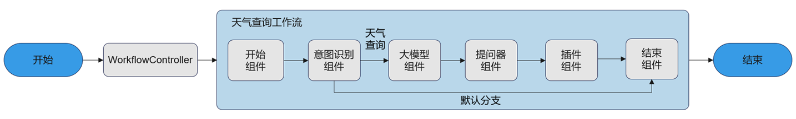

本章节示例演示了如何基于openJiuwen平台，从创建预置组件到编排工作流，最终构建并执行一个完整的天气查询WorkflowAgent。通过本示例，可以了解到如下信息：

- 如何创建组件，具体包括以下openJiuwen的预置组件：开始组件、结束组件、大模型组件、插件组件、意图识别组件、提问器组件。
- 如何创建Workflow流程图。
- 如何创建和执行`WorkflowAgent`。

# 应用设计流程

WorkflowAgent是一种专注于多步骤、任务导向的流程自动化Agent，通过严格遵循用户预定义的任务流程高效地执行复杂任务。用户可预先设定清晰的任务步骤、执行条件及角色分工，将任务拆解为多个可执行的子任务或工具，并通过组件间的拓扑连接与数据传递，逐步推进整个工作流，最终输出预期结果。其侧重于基于预设流程实现任务的规范化与高效化执行，适用于任务结构清晰、可分解为多个步骤的场景。

在本样例中，创建了一个天气查询工作流，确保能够按照预设的流程准确高效的查询到天气信息：

- 开始组件定义了工作流的输入参数规范。
- 意图识别组件判断用户请求的意图是否为查天气，如果是查天气意图，则路由到天气查询分支进行处理，否则路由到默认分支结束流程。
- 大模型组件用于对用户原始输入的query进行改写，自动补充当前日期信息和把地名转换为英文，方便提问器组件提取日期和地名信息。
- 提问器组件用于从用户输入信息中提取日期和地名信息。
- 插件组件用于使用提问器提取的日期和地名作为入参，调用天气插件进行天气查询。
- 结束组件定义了工作流的输出结果格式。



# 前提条件

JDK 版本应高于或等于 JDK 17，建议使用 JDK 21。Maven 版本建议 3.9+。

# 添加 Maven 依赖

在 `pom.xml` 中添加 openJiuwen Java SDK 依赖：

```xml
<dependency>
    <groupId>com.openjiuwen</groupId>
    <artifactId>openjiuwen-core</artifactId>
    <version>0.1.14</version>
</dependency>
```

# 创建Workflow流程

创建Workflow的整体流程如下：首先通过`Workflow`初始化工作流，指定`workflowConfig`配置参数。接着定义各组件并将组件注册到工作流，并设置组件间的连接，从而完成整个工作流的创建。本示例设计的天气查询Workflow如下：用户输入 → 意图识别 → query改写 → 参数提取 → 调用天气API → 返回结果。示例代码如下：

## 初始化工作流

初始化工作流，指定`workflowConfig`配置参数：

```java
import com.openjiuwen.core.workflow.Workflow;
import com.openjiuwen.core.workflow.WorkflowCard;
import com.openjiuwen.core.workflow.WorkflowConfig;

// 初始化工作流与上下文
String id = "test_weather_agent";
String version = "1.0";
String name = "weather";
WorkflowConfig workflowConfig = new WorkflowConfig(
    new WorkflowCard(id, name, version, "天气查询工作流")
);
Workflow flow = new Workflow(workflowConfig);
```

## 注册组件到工作流

根据任务需求创建核心组件实例，配置各组件的输入/输出规则，并将组件注册到工作流。本教程主要使用以下openJiuwen的预置组件：开始组件、结束组件、大模型组件、插件组件、意图识别组件、提问器组件。

### 开始组件

通过`Start`创建开始组件对象。开始组件作为工作流的开端，定义了工作流的输入参数规范。在本例中，开始组件的入参为固定输入参数`query`，类型为字符串，并且参数值引用自工作流的输入。示例代码如下：

```java
import com.openjiuwen.core.workflow.component.Start;

Start createStartComponent() {
    return new Start();
}
```

> **说明**
> 此处定义了开始组件的固定输入参数`query`，该参数的值引用自WorkflowAgent的输入，即用户在调用WorkflowAgent执行接口invoke、stream时，输入中必须带有`query`字段。例如`workflowAgent.invoke(Map.of("query", "你好"))`时，则开始组件接收到的输入为`{"query": "你好"}`。

### 结束组件

通过`End`创建结束组件对象。结束组件作为工作流的终止，定义了工作流的输出结果格式。在本示例中，输出结果的格式为输出文本。示例代码如下：

```java
import com.openjiuwen.core.workflow.component.End;

End createEndComponent() {
    return new End(Map.of("responseTemplate", "最终结果为：{{output}}"));
}
```

> **说明**
> 此处结束组件配置了输出文本的模板`responseTemplate`，因此最终结果会按照输出变量`output`字段的值，拼接得到字符串，作为结束组件的`responseContent`字段输出。

### 大模型组件

通过`LLMComponent`创建大模型组件，用于智能改写用户的输入内容，使得后续组件能够更精确地处理和提取关键信息。示例代码如下：

```java
import com.openjiuwen.core.workflow.component.llm.LLMComponent;
import com.openjiuwen.core.foundation.llm.schema.ModelClientConfig;
import com.openjiuwen.core.foundation.llm.schema.ModelRequestConfig;

LLMComponent createLLMComponent() {
    ModelClientConfig clientConfig = createModelClientConfig();
    ModelRequestConfig requestConfig = createModelRequestConfig();
    return new LLMComponent(clientConfig, requestConfig);
}
```

### 意图识别组件

通过`IntentDetectionComponent`构造意图识别组件，用于判断用户意图。意图识别组件提供了`addBranch`方法用于定义分支路由规则。示例代码如下：

```java
import com.openjiuwen.core.workflow.component.IntentDetectionComponent;
import com.openjiuwen.core.workflow.component.llm.IntentDetectionCompConfig;

IntentDetectionComponent createIntentDetectionComponent() {
    IntentDetectionCompConfig config = new IntentDetectionCompConfig();
    config.setUserPrompt("请判断用户的意图是否为查询天气");
    config.setCategoryNameList(List.of("查询某地天气"));
    config.setModelClientConfig(createModelClientConfig());
    config.setModelConfig(createModelRequestConfig());

    IntentDetectionComponent component = new IntentDetectionComponent(config);
    component.addBranch("${intent.classification_id} == 0", List.of("end"), "默认分支");
    component.addBranch("${intent.classification_id} == 1", List.of("llm"), "查询天气分支");
    return component;
}
```

### 提问器组件

通过`QuestionerComponent`创建提问器组件，用于从输入中提取结构化的参数信息。示例代码如下：

```java
import com.openjiuwen.core.workflow.component.llm.QuestionerComponent;
import com.openjiuwen.core.workflow.component.llm.QuestionerConfig;
import com.openjiuwen.core.workflow.component.llm.FieldInfo;

QuestionerComponent createQuestionerComponent() {
    List<FieldInfo> keyFields = List.of(
        new FieldInfo("location", "地点", true),
        new FieldInfo("date", "时间", true, "today")
    );
    QuestionerConfig config = new QuestionerConfig();
    config.setModelClientConfig(createModelClientConfig());
    config.setModelConfig(createModelRequestConfig());
    config.setQuestionContent("");
    config.setExtractFieldsFromResponse(true);
    config.setFieldNames(keyFields);
    config.setWithChatHistory(false);
    return new QuestionerComponent(config);
}
```

### 插件组件

通过`ToolComponent`创建插件组件，将天气查询API封装为可调用的工具。示例代码如下：

```java
import com.openjiuwen.core.workflow.component.tool.ToolComponent;
import com.openjiuwen.core.workflow.component.tool.ToolComponentConfig;
import com.openjiuwen.core.foundation.tool.service_api.RestfulApi;
import com.openjiuwen.core.foundation.tool.service_api.RestfulApiCard;

ToolComponent createPluginComponent() {
    ToolComponentConfig toolConfig = new ToolComponentConfig();
    RestfulApiCard weatherCard = new RestfulApiCard();
    weatherCard.setName("WeatherReporter");
    weatherCard.setDescription("天气查询插件");
    weatherCard.setUrl("your weather search api url");
    weatherCard.setMethod("GET");
    weatherCard.setInputParams(Map.of(
        "type", "object",
        "properties", Map.of(
            "location", Map.of("type", "string", "description", "天气查询的地点，必须为英文"),
            "date", Map.of("type", "string", "description", "天气查询的时间，格式为YYYY-MM-DD")
        ),
        "required", List.of("location", "date")
    ));
    RestfulApi weatherPlugin = new RestfulApi(weatherCard);
    return new ToolComponent(toolConfig).bindTool(weatherPlugin);
}
```

## 编排组件到工作流

将各个组件注册到工作流中，并定义组件之间的输入输出数据流和连接关系：

```java
import com.openjiuwen.core.workflow.component.llm.LLMComponent;

// 注册组件到工作流
flow.setStartComp("start", start,
    Map.of("query", "${query}"));

flow.addWorkflowComp("intent", intent,
    Map.of("query", "${start.query}"));

flow.addWorkflowComp("llm", llm,
    Map.of("query", "${start.query}"));

flow.addWorkflowComp("questioner", questioner,
    Map.of("query", "${llm.query}"));

flow.addWorkflowComp("plugin", plugin,
    Map.of(
        "location", "${questioner.location}",
        "date", "${questioner.date}",
        "validated", true
    ));

flow.setEndComp("end", end,
    Map.of("output", "${plugin.data}"));

// 设置组件连接
flow.addConnection("start", "intent");
flow.addConnection("llm", "questioner");
flow.addConnection("questioner", "plugin");
flow.addConnection("plugin", "end");
```

# 创建和执行WorkflowAgent

完成工作流编排后，构建`WorkflowAgent`并执行：

```java
import com.openjiuwen.core.application.workflow_agent.WorkflowAgent;
import com.openjiuwen.core.single_agent.legacy.config.WorkflowAgentConfig;

// 创建WorkflowAgent
WorkflowAgentConfig agentConfig = new WorkflowAgentConfig(
    "weather_agent", "0.1.0", "天气查询agent"
);
WorkflowAgent workflowAgent = new WorkflowAgent(agentConfig);
workflowAgent.addWorkflows(List.of(flow));

// 执行WorkflowAgent
Runner.start();
Object result = workflowAgent.invoke(Map.of(
    "conversation_id", "12345",
    "query", "上海今天天气如何"
));
System.out.println(result);
```

最终输出结果为：

```
{
  "responseContent": "最终结果为：上海今天天气晴，温度 28℃"
}
```
