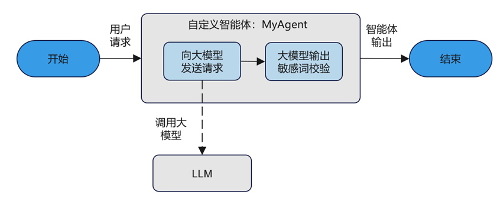

本章节演示了如何基于openJiuwen快速开发自定义智能体。该示例构建的智能体能够调用大模型服务，并且识别大模型输出结果中可能包含的敏感词。通过示例，你将会了解到如下信息：

- 如何继承`AgentConfig`基类，实现自定义智能体的配置类。
- 如何重写`BaseAgent`基类的初始化方法，实现自定义智能体的初始化。
- 如何实现`BaseAgent`基类定义的批执行抽象接口`invoke`和流式执行接口`stream`。

# 应用设计流程

本章节设计了一个自定义智能体，实现了一个更安全的智能体：能够基于预置敏感词校验输出答案。为了实现该智能体，开发者需要：

- 设计自定义智能体的配置类。
- 在智能体的初始化方法中，向智能体配置预设的敏感词列表。
- 在自定义智能体的批执行抽象接口`invoke`中，实现智能体的业务逻辑。

  <div align="center">
    
  </div>

# 前提条件

- **Java版本**: Java 21或更高版本
- **构建工具**: Maven 3.9+

# 安装openJiuwen

通过Maven将agent-core-java添加为依赖：

```xml
<dependency>
    <groupId>com.openjiuwen</groupId>
    <artifactId>agent-core-java</artifactId>
    <version>0.1.7</version>
</dependency>
```

# BaseAgent核心方法签名

在开发自定义智能体前，需要了解`BaseAgent`基类定义的核心方法：

| 方法 | 签名 | 说明 |
|------|------|------|
| `invoke` | `Object invoke(Object inputs, Session session)` | 批执行方法 |
| `stream` | `Iterator<Object> stream(Object inputs, Session session, List<StreamMode> streamModes)` | 流式执行方法 |
| `configure` | `BaseAgent configure(Object config)` | 配置方法 |

> **重要**: 方法签名必须完全匹配上述定义，使用错误的签名会导致编译失败。

# 实现自定义智能体的配置类

为了实现一个智能体能够调用大模型服务并识别敏感词，除了`AgentCard`中定义的基础配置项，还需要添加自定义配置：

```java
import com.openjiuwen.core.singleagent.schema.AgentCard;
import com.openjiuwen.core.foundation.llm.schema.ModelClientConfig;
import com.openjiuwen.core.foundation.llm.schema.ModelRequestConfig;
import java.util.List;

public class MyAgentCard extends AgentCard {
    private ModelClientConfig modelClientConfig;
    private ModelRequestConfig modelRequestConfig;
    private List<String> sensitiveWords;

    // Getters and Setters
    public ModelClientConfig getModelClientConfig() {
        return modelClientConfig;
    }

    public void setModelClientConfig(ModelClientConfig modelClientConfig) {
        this.modelClientConfig = modelClientConfig;
    }

    public ModelRequestConfig getModelRequestConfig() {
        return modelRequestConfig;
    }

    public void setModelRequestConfig(ModelRequestConfig modelRequestConfig) {
        this.modelRequestConfig = modelRequestConfig;
    }

    public List<String> getSensitiveWords() {
        return sensitiveWords;
    }

    public void setSensitiveWords(List<String> sensitiveWords) {
        this.sensitiveWords = sensitiveWords;
    }
}
```

创建配置实例：

```java
import com.openjiuwen.core.foundation.llm.schema.ModelClientConfig;
import com.openjiuwen.core.foundation.llm.schema.ModelRequestConfig;

private static MyAgentCard createAgentCard() {
    MyAgentCard card = new MyAgentCard();
    card.setId("my_custom_agent");
    card.setName("敏感词校验智能体");
    card.setDescription("我的自定义智能体");

    // 配置大模型客户端
    card.setModelClientConfig(ModelClientConfig.builder()
            .clientProvider("your-provider")
            .apiKey("your-api-key")
            .apiBase("your-api-base")
            .verifySsl(true)
            .timeout(30.0)
            .build());

    // 配置模型请求参数
    card.setModelRequestConfig(ModelRequestConfig.builder()
            .modelName("your-model-name")
            .temperature(0.7)
            .topP(0.9)
            .maxTokens(1000)
            .build());

    // 配置敏感词列表
    card.setSensitiveWords(List.of("敏感词1", "敏感词2", "敏感词3"));

    return card;
}
```

# 实现自定义Agent类

继承`BaseAgent`并实现核心方法：

```java
import com.openjiuwen.core.singleagent.BaseAgent;
import com.openjiuwen.core.singleagent.schema.AgentCard;
import com.openjiuwen.core.session.Session;
import com.openjiuwen.core.session.stream.StreamMode;
import com.openjiuwen.core.foundation.llm.Model;
import com.openjiuwen.core.foundation.llm.schema.UserMessage;
import com.openjiuwen.core.foundation.llm.schema.SystemMessage;
import java.util.Iterator;
import java.util.List;
import java.util.Map;

public class MyCustomAgent extends BaseAgent {

    private final Model model;
    private final List<String> sensitiveWords;
    private final String systemPrompt;

    public MyCustomAgent(MyAgentCard card) {
        super(card);
        this.systemPrompt = "你是一个AI助手";
        this.sensitiveWords = card.getSensitiveWords();
        this.model = new Model(
            card.getModelClientConfig(),
            card.getModelRequestConfig()
        );
    }

    @Override
    public BaseAgent configure(Object config) {
        // 配置逻辑
        return this;
    }

    @Override
    public Object getConfig() {
        return null;
    }

    /**
     * 批执行方法
     * 签名: Object invoke(Object inputs, Session session)
     */
    @Override
    public Object invoke(Object inputs, Session session) {
        Map<String, Object> inputMap = (Map<String, Object>) inputs;
        String userQuery = (String) inputMap.get("query");

        // 构造消息
        List<Map<String, Object>> messages = List.of(
            new SystemMessage(systemPrompt).modelDump(),
            new UserMessage(userQuery).modelDump()
        );

        // 调用模型
        Model.Response response = model.invoke(messages);
        String output = response.getContent();

        // 检查敏感词
        for (String word : sensitiveWords) {
            if (output.contains(word)) {
                return Map.of("output", "对不起，无法回答您的问题。", "result_type", "filtered");
            }
        }

        return Map.of("output", output, "result_type", "answer");
    }

/**
     * 流式执行方法
     * 签名: Iterator<Object> stream(Object inputs, Session session, List<StreamMode> streamModes)
     * 
     * 实现真正的流式输出：逐块处理LLM响应，实时返回给用户。
     */
    @Override
    public Iterator<Object> stream(Object inputs, Session session, List<StreamMode> streamModes) {
        Map<String, Object> inputMap = (Map<String, Object>) inputs;
        String userQuery = inputMap.get("query") != null ? inputMap.get("query").toString() : "";
        
        // 构造消息
        List<Map<String, Object>> messages = List.of(
            Map.of("role", "system", "content", systemPrompt),
            Map.of("role", "user", "content", userQuery)
        );
        
        // 获取LLM流式迭代器
        Iterator<Model.ResponseChunk> streamIterator = model.stream(messages);
        
        // 用于敏感词检测的完整响应累积
        StringBuilder fullResponse = new StringBuilder();
        
        // 返回自定义迭代器，实时处理流式输出
        return new Iterator<Object>() {
            private Model.ResponseChunk nextChunk = null;
            private boolean finished = false;
            private boolean sensitiveDetected = false;
            
            @Override
            public boolean hasNext() {
                if (finished) {
                    return false;
                }
                
                // 获取下一个chunk
                if (streamIterator.hasNext()) {
                    nextChunk = streamIterator.next();
                    fullResponse.append(nextChunk.getContent());
                    
                    // 检查敏感词（实时检测）
                    for (String word : sensitiveWords) {
                        if (fullResponse.toString().contains(word)) {
                            sensitiveDetected = true;
                            finished = true;
                            return true; // 返回最后一次过滤提示
                        }
                    }
                    return true;
                } else {
                    // 流结束
                    finished = true;
                    return false;
                }
            }
            
            @Override
            public Object next() {
                if (sensitiveDetected) {
                    // 敏感词检测到，返回过滤提示
                    return Map.of(
                        "chunk", "[内容已过滤]",
                        "finish_reason", "filtered",
                        "result_type", "filtered"
                    );
                }
                
                if (nextChunk != null) {
                    // 返回流式chunk
                    return Map.of(
                        "chunk", nextChunk.getContent(),
                        "finish_reason", nextChunk.isFinished() ? "stop" : null,
                        "result_type", "streaming"
                    );
                }
                
                // 流结束后的最终结果
                return Map.of(
                    "output", fullResponse.toString(),
                    "finish_reason", "complete",
                    "result_type", "answer"
                );
            }
        };
    }
}

> **关键点**: 
> - `invoke`方法签名必须为 `Object invoke(Object inputs, Session session)`
> - `stream`方法返回类型必须为 `Iterator<Object>`
> - 不要使用虚构的`StreamConsumer`接口
> - 流式实现应实时处理每个chunk，而非等待全部完成

# 运行自定义智能体

```java
import com.openjiuwen.core.runner.Runner;
import java.util.Map;

public class CustomAgentExample {

    public static void main(String[] args) {
        try {
            // 创建Agent
            MyAgentCard card = createAgentCard();
            MyCustomAgent agent = new MyCustomAgent(card);

            // 执行
            Map<String, Object> result = (Map<String, Object>) Runner.runAgent(
                agent,
                Map.of("query", "写一个笑话", "conversation_id", "custom_example_001"),
                null,
                null
            );

            System.out.println("结果: " + result.get("output"));
        } finally {
            Runner.release("custom_example_001");
            Runner.stop();
        }
    }
}
```

输出示例：

```text
结果: 为什么程序员不喜欢在夏天出门？因为他们害怕"中暑"...
```

# 完整示例代码

```java
package examples.custom_agent;

import com.openjiuwen.core.foundation.llm.Model;
import com.openjiuwen.core.foundation.llm.schema.ModelClientConfig;
import com.openjiuwen.core.foundation.llm.schema.ModelRequestConfig;
import com.openjiuwen.core.foundation.llm.schema.SystemMessage;
import com.openjiuwen.core.foundation.llm.schema.UserMessage;
import com.openjiuwen.core.runner.Runner;
import com.openjiuwen.core.session.Session;
import com.openjiuwen.core.session.stream.StreamMode;
import com.openjiuwen.core.singleagent.BaseAgent;
import com.openjiuwen.core.singleagent.schema.AgentCard;
import java.util.Iterator;
import java.util.List;
import java.util.Map;

// 自定义AgentCard
public class MyAgentCard extends AgentCard {
    private ModelClientConfig modelClientConfig;
    private ModelRequestConfig modelRequestConfig;
    private List<String> sensitiveWords;

    public ModelClientConfig getModelClientConfig() { return modelClientConfig; }
    public void setModelClientConfig(ModelClientConfig config) { this.modelClientConfig = config; }
    public ModelRequestConfig getModelRequestConfig() { return modelRequestConfig; }
    public void setModelRequestConfig(ModelRequestConfig config) { this.modelRequestConfig = config; }
    public List<String> getSensitiveWords() { return sensitiveWords; }
    public void setSensitiveWords(List<String> words) { this.sensitiveWords = words; }
}

// 自定义Agent实现
public class MyCustomAgent extends BaseAgent {
    private final Model model;
    private final List<String> sensitiveWords;

    public MyCustomAgent(MyAgentCard card) {
        super(card);
        this.sensitiveWords = card.getSensitiveWords();
        this.model = new Model(card.getModelClientConfig(), card.getModelRequestConfig());
    }

    @Override
    public BaseAgent configure(Object config) { return this; }

    @Override
    public Object getConfig() { return null; }

    @Override
    public Object invoke(Object inputs, Session session) {
        Map<String, Object> inputMap = (Map<String, Object>) inputs;
        String userQuery = inputMap.get("query") != null ? inputMap.get("query").toString() : "";

        List<Map<String, Object>> messages = List.of(
            Map.of("role", "system", "content", "你是一个AI助手"),
            Map.of("role", "user", "content", userQuery)
        );

        Model.Response response = model.invoke(messages);
        String output = response.getContent();

        for (String word : sensitiveWords) {
            if (output.contains(word)) {
                return Map.of("output", "对不起，无法回答您的问题。", "result_type", "filtered");
            }
        }

        return Map.of("output", output, "result_type", "answer");
    }

    @Override
    public Iterator<Object> stream(Object inputs, Session session, List<StreamMode> streamModes) {
        Object result = invoke(inputs, session);
        return List.of(result).iterator();
    }
}

// 运行示例
public class CustomAgentExample {
    public static void main(String[] args) {
        MyAgentCard card = new MyAgentCard();
        card.setId("custom_agent_example");
        card.setName("敏感词校验Agent");
        card.setModelClientConfig(ModelClientConfig.builder()
                .clientProvider("your-provider")
                .apiKey("your-api-key")
                .apiBase("your-api-base")
                .build());
        card.setModelRequestConfig(ModelRequestConfig.builder()
                .modelName("your-model")
                .temperature(0.7)
                .build());
        card.setSensitiveWords(List.of("敏感词"));

        MyCustomAgent agent = new MyCustomAgent(card);

        try {
            Map<String, Object> result = (Map<String, Object>) Runner.runAgent(
                agent,
                Map.of("query", "写一个笑话"),
                null, null
            );
            System.out.println(result.get("output"));
        } finally {
            Runner.stop();
        }
    }
}
```

# 最佳实践

## 1. 错误处理

```java
@Override
public Object invoke(Object inputs, Session session) {
    try {
        return doInvoke(inputs, session);
    } catch (IllegalArgumentException e) {
        return Map.of("error", "输入参数错误: " + e.getMessage(), "result_type", "error");
    } catch (Exception e) {
        return Map.of("error", "执行出错: " + e.getMessage(), "result_type", "error");
    }
}
```

## 2. 配置验证

```java
public MyCustomAgent(MyAgentCard card) {
    super(card);
    
    if (card.getModelClientConfig() == null) {
        throw new IllegalArgumentException("ModelClientConfig is required");
    }
    if (card.getSensitiveWords() == null || card.getSensitiveWords().isEmpty()) {
        throw new IllegalArgumentException("SensitiveWords must not be empty");
    }
    
    this.model = new Model(card.getModelClientConfig(), card.getModelRequestConfig());
    this.sensitiveWords = card.getSensitiveWords();
}
```

# 相关资源

- 源代码: `src/main/java/com/openjiuwen/core/singleagent/BaseAgent.java`
- 示例代码: `examples/`目录下的Agent示例
- API文档: `documents/zh/2.开发指南/API文档/com.openjiuwen.core/singleagent.README.md`