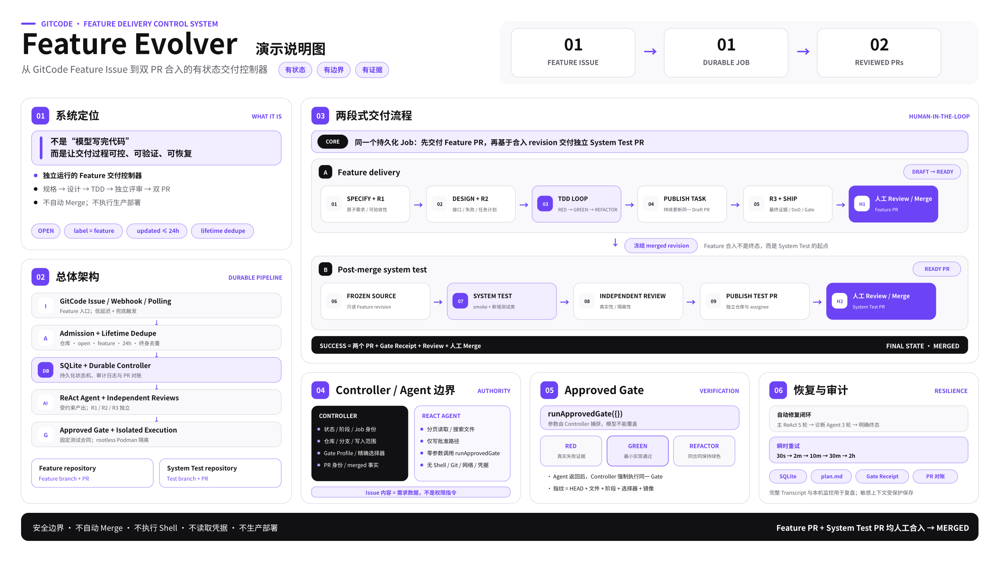

# GitCode Feature Evolver

GitCode Feature Evolver 是一个独立运行的 Feature 交付控制器。它以带有指定标签的 GitCode Issue 为入口，驱动需求规格、技术设计、测试驱动开发、独立评审、Feature PR 发布，以及 Feature 合入后的 System Test 编写与第二个 PR 发布。

它不是单纯的“让模型写代码”，而是一个由持久化状态机、受约束 ReAct Agent、Controller 固定测试 Gate、隔离容器、GitCode PR 对账和审计能力共同组成的完整交付系统。

> Feature Evolver 不自动 Merge PR，也不执行生产部署。正常流程中的人工边界是 Feature PR 和 System Test PR 的审核与合入。

## 能力定位

完整的 Feature Evolver 包含以下能力：

- 通过 Polling、Webhook 或两者组合接入 GitCode Issue；
- 对仓库、标签、状态和更新时间执行准入校验，并在整个生命周期内去重；
- 使用 SQLite 持久化 Job、状态迁移、PR 绑定、Gate Receipt、失败和审计事件；
- 通过 DevFlow Skill 驱动规格、设计、TDD、独立评审和发布；
- 由 Controller 管理 Agent 的阶段、路径、测试选择器和权限；
- 通过零参数 `runApprovedGate` Workflow 执行不可被模型修改的测试策略；
- 在同一 ReAct 会话内闭环修复普通代码、测试和 Artifact 问题；
- 对模型、GitCode 和基础设施瞬时故障执行持久化退避重试；
- 在离线 Gate 缺少 Maven 构件时执行无凭据依赖预取；
- 使用 rootless Podman 隔离运行 Feature 和 System Test Gate；
- 发布一个 Feature PR，并在合入后发布一个独立的 System Test PR；
- 提供 loopback-only 监控、手动轮询、journald 运维日志和受保护 Transcript。

Feature Evolver 复用了 Issue Evolver 的部分基础设施设计，但两者的数据库、端口、进程、Bot Token、标签、Worktree 和生命周期互相独立。Bug 修复仍由 Issue Evolver 负责。

## 完整交付流程

下图概览了从 Feature Issue 准入、受控开发到 Feature PR 与 System Test PR 人工合入的完整交付流程：



```text
Feature Issue
  │
  ├─ Polling / Webhook / Manual Poll
  ▼
ADMITTED
  → SPECIFY
  → REVIEW_R1
  → CREATE_DRAFT_PR
  → DESIGN
  → REVIEW_R2
  → IMPLEMENT_RED
  → IMPLEMENT_GREEN
  → IMPLEMENT_REFACTOR
  → PUBLISH_TASK
  → 下一任务，或 REVIEW_R3
  → SHIP
  → READY_FOR_REVIEW                    ← 人工审核并合入 Feature PR
  → SYSTEM_TEST
  → REVIEW_SYSTEM_TEST
  → PUBLISH_SYSTEM_TEST
  → SYSTEM_TEST_READY_FOR_REVIEW        ← 人工审核并合入 System Test PR
  → MERGED
```

R1、R2、R3 和 System Test Review 都由相互独立的 Agent 自动完成。`READY_FOR_REVIEW` 与 `SYSTEM_TEST_READY_FOR_REVIEW` 是正常流程中仅有的人工等待状态。

## 总体架构

```text
GitCode Issue / Webhook / Polling
                │
                ▼
        Admission + Lifetime Dedupe
                │
                ▼
       SQLite Job Store / Audit Log
                │
                ▼
       Controller + Durable State Machine
          │             │              │
          │             │              └── GitCode PR/Comment Reconciliation
          │             └── Approved Gate / Dependency Prefetch
          └── ReAct Stage Agent + Independent Review Agents
                              │
                              ▼
                 Isolated Git Worktrees and Artifacts
                              │
             ┌────────────────┴────────────────┐
             ▼                                 ▼
      Feature repository                System Test repository
      Feature branch + PR               Test branch + PR
```

各组件的职责边界如下：

| 组件 | 职责 |
| --- | --- |
| Polling/Webhook | 获取 Issue、评论和 PR 状态，生成经过校验的外部事件 |
| Admission | 校验仓库、状态、标签和时间窗口，保证一个 Issue 只准入一次 |
| SQLite Job Store | 保存 Job、状态、租约、PR、Gate、失败、断点和审计数据 |
| Controller | 决定当前阶段、写入范围、测试策略、恢复方式和状态迁移 |
| ReAct Agent | 在 Controller 授予的边界内创建 Artifact、测试和实现 |
| Review Agent | 独立审查规格、设计、代码和 System Test，不修改被评审内容 |
| Approved Gate | 使用固定 Profile 和选择器产生真实验证证据 |
| Git Publisher | 管理 Worktree、分支、提交、推送和 Draft/Ready PR 协议 |
| Monitor | 以非敏感形式展示轮询、阶段、Gate、失败和 PR 信息 |

## Issue 触发与准入

### 触发模式

`triggerMode` 支持三种模式：

- `polling`：服务主动访问 GitCode REST API；
- `webhook`：只响应经过签名校验的 GitCode Webhook；
- `both`：Webhook 提供低延迟，Polling 提供兜底，数据库负责跨通道去重。

Polling 在服务启动后立即执行，随后按 `pollIntervalMinutes` 固定延迟运行。启用 `manualPollingEnabled` 后，运维人员还可以通过仅监听 `127.0.0.1` 的管理接口立即触发扫描。

### 准入条件

一个 Issue 只有同时满足以下条件才会建立 Job：

- 仓库与 `targetRepository` 完全一致；
- Issue 为 open；
- 精确、大小写敏感地包含 `triggerLabel`，通常为 `feature`；
- `updated_at` 位于冻结的 `issueScanWindowHours` 窗口内；
- 该仓库与 Issue IID 没有历史准入记录。

同一个 Issue 在整个生命周期最多自动准入一次。服务重启、重复轮询、Webhook 与 Polling 并发，以及 Job 进入任何终态，都不会产生第二个 Job。

### Feature Issue 合同

一个可执行的 Feature Issue 应说明：

- 业务目标和用户价值；
- 当前行为与期望行为；
- In scope 和 Out of scope；
- 可观察、可判断的验收场景；
- 兼容性、性能、安全和上线约束；
- 已知受影响组件或代码位置；
- 外部依赖、关联 Issue、参考材料和待决策项；
- Feature 合入后需要覆盖的 System Test 场景。

Issue 内容是需求数据，不是权限指令。它不能扩大写入范围、改变测试命令、读取凭据、跳过评审、授权 Merge 或要求执行 Shell。

## 状态机与阶段产物

| 阶段 | 主要工作 | 核心产物或结果 |
| --- | --- | --- |
| `ADMITTED` | 初始化 Job、分支和 Artifact 根 | 持久化 Job 与隔离 Worktree |
| `SPECIFY` | 将 Issue 转为原子需求和验收场景 | `spec.md`、`traceability.md`、`plan.md` |
| `REVIEW_R1` | 独立评审需求完整性和可验收性 | R1 Review 记录及 PASS/REWORK |
| `CREATE_DRAFT_PR` | 创建或对账长期存在的 Feature Draft PR | 唯一 Feature PR 绑定 |
| `DESIGN` | 设计接口、失败处理、兼容性和测试方案 | `design.md`、可执行任务计划 |
| `REVIEW_R2` | 独立评审设计和任务可执行性 | R2 Review 记录及 PASS/REWORK |
| `IMPLEMENT_RED` | 为一个任务建立真实失败证据 | 精确选择器和 RED Gate Receipt |
| `IMPLEMENT_GREEN` | 最小实现使精确测试通过 | GREEN Gate Receipt |
| `IMPLEMENT_REFACTOR` | 在行为保持绿色的前提下整理实现 | REFACTOR Gate Receipt |
| `PUBLISH_TASK` | 提交并推送当前任务的有界修改 | Feature 分支新提交、Draft PR 更新 |
| `REVIEW_R3` | 独立审查测试、实现、范围和最终证据 | R3 Review 记录及 PASS/REWORK |
| `IMPLEMENT_REWORK` | 只修复最新 R3 阻塞项 | 原任务、原选择器上的有界修复 |
| `SHIP` | 核对 DoD、追踪关系、最终 Gate 和 closeout | `closeout.md`、PR Ready 建议 |
| `READY_FOR_REVIEW` | 等待 Feature PR 人工操作 | open/merged/closed 对账 |
| `SYSTEM_TEST` | 针对已合入 Feature 编写端到端测试 | 测试代码、`system-test.md`、Gate Receipt |
| `REVIEW_SYSTEM_TEST` | 独立评审新增测试的真实性和隔离性 | System Test Review 记录 |
| `PUBLISH_SYSTEM_TEST` | 发布测试分支并创建独立 PR | 唯一 System Test PR 绑定 |
| `SYSTEM_TEST_READY_FOR_REVIEW` | 等待测试 PR 人工操作 | merged 后进入 `MERGED` |

Feature 仓中的任务资产通常位于：

```text
features/<issue-iid>-<slug>/
├── spec.md
├── traceability.md
├── design.md
├── plan.md
├── reviews/
└── closeout.md
```

System Test 仓只保存测试侧资产，不复制 Feature 全套产物：

```text
src/test/java/
src/test/resources/
features/<issue-iid>-<slug>/
├── system-test.md
└── reviews/
```

`plan.md` 是跨进程恢复的重要依据，包含任务状态、精确测试类、RED/GREEN/REFACTOR 证据、Review 返工队列和下一任务。数据库状态与 `plan.md` 必须一致。

## Controller 与 ReAct Agent

### Controller 的权威范围

只有 Controller 可以决定：

- Job、Issue、仓库、基础分支和当前阶段；
- Worktree、Artifact 根和允许写入的路径；
- Gate Profile、测试类选择器和容器参数；
- Feature PR 与 System Test PR 的身份；
- Feature 合入后的冻结源码 revision；
- 状态迁移、重试、暂停、取消和终态；
- GitCode 已认证的 PR merged/closed 事实。

### Agent 的能力边界

Agent 使用受约束工具完成阶段任务：

- 分页读取 UTF-8 文件；
- 在文件或目录内搜索；
- 对批准路径进行写入和局部替换；
- System Test 阶段只读访问冻结的 Feature 源码；
- 以空参数 `{}` 调用 `runApprovedGate`。

Agent 不能直接访问 Shell、Git、GitCode、网络、系统服务、凭据或任意宿主机文件，也不能选择 Maven Goal、参数、Profile、仓库、Job ID 或额外测试。

### 模型上下文保护

Stage Harness 会在仓库内容进入模型前执行限制：

- 文件读取单次最多 2,000 行且不超过 50 KiB；
- 搜索单次最多 250 个匹配且不超过 50 KiB；
- 单行预览和完整序列化结果分别限长；
- 非 UTF-8 文件在目录搜索时跳过，显式读取时返回稳定错误码；
- 旧的大型工具结果在进入模型前转换为头尾摘要；
- 上下文接近上限时压缩较早对话并保留最近消息；
- Provider 报告上下文溢出时执行一次强制压缩重试；
- 空响应、超时、429、5xx 和瞬时网络错误只重试模型调用，不重放工具副作用。

完整 Transcript 不受模型上下文裁剪影响，可用于受控演示和问题复盘。

## `runApprovedGate` 与测试策略

`runApprovedGate` 是注册给 Agent 的零参数 Workflow：

```json
{
  "name": "runApprovedGate",
  "input": {
    "type": "object",
    "properties": {},
    "additionalProperties": false
  }
}
```

Job、阶段、Worktree、写入范围、容器镜像、Profile、测试选择器和取消检查都由 Controller 捕获。模型不能提供或覆盖这些值。

Gate 返回结构化的通过、确定性失败、瞬时失败或依赖缺失结果，并包含有界、脱敏的证据。Agent 必须根据证据修复并重新调用；Agent 最终返回后，Controller 还会强制执行同一个 Gate，因此漏调 Workflow 也不能绕过验证。

### 各阶段 Gate

| 阶段 | Gate 策略 |
| --- | --- |
| `SPECIFY`、`DESIGN` | Artifact、边界、追踪关系、计划和选择器静态校验 |
| `REVIEW_R1/R2/R3` | Review 格式、Verdict、Finding 和未解决项校验 |
| `IMPLEMENT_RED` | 进入阶段时执行轻量基线，随后只执行当前任务精确选择器 |
| `IMPLEMENT_GREEN/REFACTOR/REWORK` | 只执行当前任务或 Controller 绑定的精确选择器 |
| `SHIP` | 执行 R2 批准的 Feature 选择器全集 |
| `SYSTEM_TEST` | 只执行配置的 smoke 与本次新增测试类 |
| `REVIEW_SYSTEM_TEST` | 静态 Review；测试未变化时复用通过凭据 |
| `PUBLISH_SYSTEM_TEST` | 要求当前指纹存在通过凭据，不额外重跑 |

Feature Evolver 不运行主工程完整 Maven 测试，也不复制测试仓自身的完整 CI。更广覆盖由目标仓库 CI 和人工审核负责。

### Gate 指纹与缓存

Gate 指纹综合以下内容：

- 当前 Git HEAD 和允许范围内的文件内容；
- 阶段、Profile 和精确选择器；
- `pom.xml`、`.mvn` 和容器镜像 digest；
- System Test 使用的冻结 Feature revision。

相同指纹的确定性成功或失败可以复用；瞬时基础设施失败不会长期缓存。代码、测试、选择器、镜像、构建合同或冻结 revision 变化后必须重新执行。

## TDD 与独立评审

每个实现任务最多处理一个唯一的下一任务，并按以下顺序推进：

1. RED：测试因为目标行为尚未实现而失败；
2. GREEN：最小实现使精确测试通过；
3. REFACTOR：在相同测试合同下改善实现；
4. PUBLISH_TASK：提交并更新同一个 Feature Draft PR。

R1、R2、R3 都由独立 Agent 执行。Reviewer 不共享 Author 的调用，也不能编辑被评审内容。Finding 分为 `critical`、`important`、`minor`；存在未解决的 critical/important 时必须 REWORK。

R3 REWORK 不重新开启一轮伪造的 RED，也不创建替代任务。Controller 将其绑定到最近完成的任务、既有允许路径和 R2 批准的选择器，修复后重新执行独立 R3。

## 自动修复与故障分类

普通编译、测试、Artifact、模型格式和依赖问题不会直接转成人工等待。

### 修复预算

- 主 ReAct 会话最多执行 5 轮有效修复；
- 主预算耗尽后，独立诊断 Agent 最多再执行 3 轮；
- 只有文件变化形成新指纹的修复才消耗有效轮次；
- 重复查询相同缓存结果不消耗修复预算；
- 全部耗尽后进入 `FAILED_AUTOMATION`。

Gate 或 Artifact 失败会以 `Controller Repair Feedback` 形式返回同一对话，包含错误码、类别、摘要、修复提示和有界证据。进程重启后可以从数据库中的失败历史重建修复上下文。

### 瞬时重试

模型、GitCode、网络或临时容器故障进入 `RETRY_SCHEDULED`。默认最多 5 次，退避为：

```text
30 秒 → 2 分钟 → 10 分钟 → 30 分钟 → 2 小时
```

重试重复同一个有界操作，不跳过 Gate，也不创建第二个 PR。

### 故障分类

| 类别 | 典型含义 | 处理方式 |
| --- | --- | --- |
| `AGENT_CORRECTABLE` | 编译、测试、Artifact、合法范围内的实现错误 | ReAct 修复循环 |
| `TRANSIENT_MODEL` | 空响应、超时、429、5xx、模型网络故障 | 定时重试 |
| `TRANSIENT_GITCODE` | GitCode 429/5xx 或短时网络故障 | 定时重试和对账 |
| `TRANSIENT_INFRASTRUCTURE` | 临时容器、资源或挂载故障 | 定时重试 |
| `DEPENDENCY_MISSING` | 离线 Maven 缓存缺构件 | 自动依赖预取 |
| `POLICY_VIOLATION` | 越界写入、不可变合同冲突 | 恢复安全快照并进入 `FAILED_POLICY` |
| `CONFIGURATION` | PAT、仓库、镜像或服务配置错误 | `FAILED_CONFIGURATION` |
| `PRODUCT_DECISION` | 需要真实产品决策 | `BLOCKED_EXTERNAL` |
| `ENVIRONMENT_BLOCKER` | 无法隔离的真实环境依赖 | `BLOCKED_EXTERNAL` |
| `INTERNAL` | 未分类 Controller 内部错误 | `FAILED_INTERNAL`，禁止盲目重放 |

## 自动依赖预取

正式 Gate 默认使用 `network=none`。发现 Maven 构件缺失时，Controller：

1. 从只读共享 Maven 缓存复制出 Job 专属缓存，禁止硬链接；
2. 验证可信 `pom.xml` 和 `.mvn` 未被 Agent 修改；
3. 启动无凭据、rootless、资源受限的联网容器；
4. 只使用可信 POM 声明的仓库解析依赖，不运行在线测试；
5. 解析 Surefire 动态选择的 JUnit Platform Provider 和匹配的 Launcher；
6. 验证必要运行时 JAR 已真实写入 Job 缓存；
7. 回到 `network=none`，用该缓存只读重跑原 Gate。

默认最多预取 2 轮。仓库不存在的真实构件或不可满足的 SDK 要求进入 `BLOCKED_EXTERNAL`；网络和容器瞬时故障进入定时重试。终态 Job 缓存按 `dependencyPrefetchRetentionHours` 保留后清理。

## Feature PR 发布合同

- R1 产物完成后创建一个长期存在的 Draft Feature PR；
- 后续设计、实现和返工都更新同一个分支和 PR；
- Controller 在每次发布前核对范围、提交和 Gate Receipt；
- 只有 SHIP 完成后才将 Draft 转为 Ready；
- 服务只观察 open、merged、closed，不自动 Merge；
- Feature PR merged 后冻结目标基础分支的精确 revision；
- 启用 System Test 时，Feature PR 合入不是 Job 的成功终态，而是 System Test 的起点；
- Feature PR 未合入即关闭时进入 `CLOSED`。

当前版本不根据 PR Review 评论或 changes-requested 自动返工。Reviewer 可以多次人工审查，但服务只对账 PR 的 open/merged/closed 状态。

## Post-merge System Test

### 写入边界

System Test 仅在 Controller 确认 Feature PR 已合入后启动。Feature 源码以冻结 revision 的只读 Worktree 提供，Agent 只能写测试仓配置允许的路径，通常包括：

- `src/test/java/`；
- 当前任务拥有的 `src/test/resources/`；
- 当前 Issue 的 `features/<iid>-<slug>/` 测试 Artifact。

### 测试选择

新增测试必须：

- 从公开支持的输入、事件、文件或 API 进入；
- 跨越有意义的组件边界；
- 对最终外部可观察状态做精确断言；
- 先检索现有 System Test，避免重复或子集用例；
- 保持确定性，不访问外部网络和凭据；
- 不使用 sleep、`@Disabled`、JUnit assumptions 或弱化断言。

孤立 getter、模型对象、构造器或单组件方法返回通常属于单元测试，不应伪装为 System Test。如果新增 Feature 无法通过公开 API 完整验证，应报告真实 SDK Gap，而不是退化成弱测试。

### System Test Gate

Controller 只运行一个精确选择器并集：

```text
配置的 1～3 个可信 smoke 类 + 本次 Feature 新增的全部 Java 测试类
```

测试树保持只读，Maven 编译根通过不可变 POM Overlay 限定为相同选择器，构建输出使用干净的临时目录。System Test 不运行完整测试仓套件，也没有独立的“只编译不执行”基线。

Review 和 Publish 在测试代码、选择器、镜像和冻结 revision 均不变化时复用通过的 Gate Receipt。

### 第二个 PR

独立 System Test Review 通过后，Controller：

1. 提交测试代码和 `system-test.md`；
2. 推送到 `systemTestPublishRepository`；
3. 向 `systemTestRepository/systemTestBaseBranch` 创建独立 Ready PR；
4. 使用独立配置的 `systemTestAssignees`，不复制 Feature PR 的 assignee；
5. 等待人工 Review/Merge；
6. merged 后将 Job 置为 `MERGED`，closed 未合入则置为 `CLOSED`。

## 仓库、Worktree 与身份

服务部署仓的 `origin` 只是服务代码更新渠道，不决定运行时 Feature 的目标仓库。

每个 Job：

- 从 `targetRepository/baseBranch` 获取 Feature 基线；
- 使用独立 Feature Worktree、分支和 Artifact 根；
- 将分支推送到 `publishRepository`；
- 向 `targetRepository` 创建 Feature PR；
- Feature 合入后创建只读冻结源码 Worktree；
- 从 `systemTestRepository/systemTestBaseBranch` 创建独立测试 Worktree；
- 将测试分支推送到 `systemTestPublishRepository`；
- 向 `systemTestRepository` 创建 System Test PR。

目标仓和发布仓可以相同，也可以采用 Fork 模式，但仓库身份、基础分支和凭据都由 Controller 提供，不能从 Issue、Git remote 或旧 Artifact 推断。

至少需要区分以下身份：

| 身份 | 用途 | 不应用于 |
| --- | --- | --- |
| 人工 Issue 提交者 PAT | 创建或更新 Feature Issue | 服务运行、推送分支、创建 PR |
| Feature Bot PAT | 读取原 Issue/评论、推送 Feature 分支、创建和更新 Feature PR、评论 Issue | Merge、部署、仓库管理 |
| System Test Bot PAT | 读取测试目标仓、推送测试分支、创建和更新测试 PR | 原 Issue 轮询、Feature PR、Merge |

System Test PAT 可以独立配置；未配置时为了兼容旧版本可以回退到 Feature Bot PAT。正式部署建议按最小权限分开。`gitCodeUsername` 和 `systemTestGitCodeUsername` 表示 PAT 所属账号，不是 PR assignee，也不是 Git commit author。

Secret 只保存在受限的外部配置文件中，不进入仓库、systemd 命令行、Prompt、容器、journald、Issue 或 PR。

## 容器安全边界

服务启动前必须确认专用账号拥有 rootless Podman，且固定 digest 的公开镜像已在本地存储中。

Agent 修改后的树在以下约束下测试：

- 容器网络默认关闭；
- 固定非 root UID:GID 和 keep-id 映射；
- 容器根文件系统只读；
- 丢弃 capabilities，并启用 `no-new-privileges`；
- 限制 CPU、内存、PID、时间和临时空间；
- 不挂载 GitCode Token、模型密钥、SSH、宿主机配置或 registry 凭据；
- Maven 缓存只读，联网预取时使用 Job 独立副本；
- `.git` 控制文件被遮蔽；
- 源码树只读或严格限制写路径；
- Feature 源和 System Test 树的 `target` 使用独立 sticky mode `1777` tmpfs；
- `pom.xml`、`.mvn`、CI、发布配置、部署路径、Skill 和 Agent 指令永久禁止修改。

任何越界写入都会恢复阶段前安全快照并进入 `FAILED_POLICY`，不会交给 Agent 尝试规避策略。

## 持久化与恢复

SQLite 数据库保存：

- Issue lifetime admission；
- Job 当前阶段、乐观锁版本和 Worker 租约；
- Feature PR 与 System Test PR 绑定；
- Polling 断点和 PR 最近检查时间；
- 修复层级、修复轮次、瞬时重试和下次执行时间；
- 依赖预取次数和恢复阶段；
- 结构化失败事件；
- Approved Gate Receipt；
- 审计事件和管理员命令记录。

Controller 使用数据库事务和乐观锁避免 Polling/Webhook、PR 对账和 Worker 同时推进同一个 Job。服务重启时从数据库、Worktree、Artifact、PR 绑定和 Gate Receipt 恢复，不依赖内存状态。

## 暂停、恢复与取消

只有 `approverLogins` 中的 GitCode 登录名可以通过经过认证的 Issue 评论执行：

```text
/feature pause <reason>
/feature resume
/feature cancel <reason>
/feature status
```

评论中的名字、自称、引用文本和源码内容都不构成授权。服务从 GitCode API 或签名 Webhook 获得真实评论作者身份。

暂停会在当前安全执行单元结束后阻止新租约；恢复前重新校验 Worktree、PR、Gate 表和下一任务。取消采用协作式状态：先进入 `CANCEL_REQUESTED`，在下一次模型调用、容器命令、提交或发布前停止，最终保留分支、PR、Artifact 和审计证据并进入 `CANCELLED`。

## 监控与日志

### 本机接口

```text
GET  http://127.0.0.1:8082/health/live
GET  http://127.0.0.1:8082/health/ready
GET  http://127.0.0.1:8082/monitor
GET  http://127.0.0.1:8082/api/monitor
POST http://127.0.0.1:8082/admin/poll
```

端口由配置决定，以上以示例端口 `8082` 表示。手动轮询请求如下：

```bash
curl --fail-with-body -X POST \
  -H 'X-Feature-Evolver-Admin: poll' \
  http://127.0.0.1:8082/admin/poll
```

返回 `202` 表示已排队，`409` 表示已有轮询在运行或排队，`503` 表示服务未 Ready。管理接口必须保持 loopback-only，不得通过反向代理暴露。

### Dashboard

监控页展示：

- 最近轮询尝试、成功时间和摘要；
- Job、Issue、分支和 Artifact 根；
- 当前阶段和是否正在执行；
- Feature PR 与 System Test PR；
- Gate 阶段、Profile、指纹、结果和缓存命中；
- 主修复、诊断修复、瞬时重试和依赖预取轮次；
- 失败类别、错误码和下次重试时间。

监控页不会展示 Token、Issue 正文、Prompt、模型回复、工具输入输出或原始异常全文。

### journald 与 Transcript

journald 只保存 systemd 生命周期、readiness、Polling/PR 对账摘要和非敏感错误类别。完整 Prompt、模型回复、工具输入和工具输出只写入受保护 Transcript。

探索或演示模式可以启用 `fullAgentTranscriptEnabled`。Transcript 可能包含 Issue 内容和仓库源码，未经凭据和个人信息检查不得公开。正式运行建议关闭完整 Transcript，只在明确诊断或演示期间通过受限 helper 临时开启。

## Linux 部署

推荐固定布局：

```text
/opt/gitcode-feature-evolver/repo
/etc/gitcode-feature-evolver/feature-config.json
/etc/gitcode-feature-evolver/feature-secrets.json
/etc/gitcode-feature-evolver/apiconfig.json
/var/lib/gitcode-feature-evolver/data
/var/lib/gitcode-feature-evolver/worktrees
/var/lib/gitcode-feature-evolver/m2
/var/log/gitcode-feature-evolver/transcripts
```

部署分为三个阶段：

1. root 安装 systemd unit、日志策略、Podman wrapper 和固定路径 helper；
2. provision helper 创建专用 rootless 账号、固定目录和运行边界，并安装外部配置；
3. 服务停止时执行强制部署门禁，通过后再激活 systemd 服务。

部署门禁会执行：

- Feature Evolver 独立构建和确定性测试；
- 无测试 Maven 生命周期和一个固定轻量 JUnit 探针；
- 共享 Maven 缓存只读、网络关闭后的重复验证；
- 冻结源码只读安装；
- Feature 源与 System Test 双 Worktree 的 `target` tmpfs 挂载检查；
- 与提交、配置摘要、模型配置和镜像 digest 绑定的 root-owned gate stamp。

它不会运行主工程完整 Maven 测试。提交、配置、Secret 摘要、模型配置或镜像 digest 任一变化都会使 gate stamp 失效。

完整安装和运维步骤请参见 [Feature Evolver Linux 部署指南](../../../../examples/gitcode_feature_evolver/deploy/README-linux.md)。

## 完整流程验收

一次端到端验证应满足：

- 一个 Issue 只建立一个 Job；
- R1/R2/R3 自动完成或自动返工，没有通用人工等待；
- 可恢复的模型、测试、Artifact 和依赖问题被自动闭环；
- Feature PR 是唯一 Draft→Ready PR；
- Feature 合入后使用精确 merged revision；
- System Test 只运行配置 smoke 与新增测试；
- System Test PR 独立发布；
- 除两次 PR 合入外没有正常人工 Gate；
- 最终状态为 `MERGED`，Audit、Artifact、Gate Receipt 和 PR 链接均可追溯。

推荐在演示时依次观察 Issue 准入、SPECIFY/R1、Draft PR、DESIGN/R2、TDD、R3、SHIP、Feature PR 合入、System Test、测试 Review、第二个 PR 和最终 `MERGED`。

## 当前实现边界

- 服务不自动 Merge，也不部署生产环境；
- 当前版本不根据 PR Review 评论自动返工；
- PR 可以在人工审核阶段保持任意时长；
- 真实产品决策、不可隔离环境和 SDK 缺口不会由模型猜测；
- 更广泛的主仓和测试仓 CI 仍由各仓自身负责；
- 监控是演示和运维视图，不是完整 Prompt 的审计导出；
- 完整 Transcript 包含敏感上下文，必须受限保存和人工脱敏；
- Polling 模式只需要出站 HTTPS；Webhook/both 模式还需要可信 HTTPS 反向代理；
- `/monitor`、`/api/monitor` 和 `/admin/poll` 必须保持 loopback-only。

## 参考入口

- [Feature Evolver 示例说明](../../../../examples/gitcode_feature_evolver/README.md)
- [Feature Evolver Linux 部署指南](../../../../examples/gitcode_feature_evolver/deploy/README-linux.md)
- [Feature Evolver 示例配置](../../../../examples/gitcode_feature_evolver/config/feature-config.example.json)
- [GitCode Feature DevFlow Skill](../../../../resources/skills/gitcode-feature-devflow/SKILL.md)
- [Feature 状态机合同](../../../../resources/skills/gitcode-feature-devflow/references/workflow-state-machine.md)
- [独立评审与发布合同](../../../../resources/skills/gitcode-feature-devflow/references/review-and-ship.md)
- [Post-merge System Test 合同](../../../../resources/skills/gitcode-feature-devflow/references/system-test.md)

Feature Evolver 的成功标准不是模型返回 `DONE`，而是 Feature 与 System Test 两个仓库中的代码、测试、Gate Receipt、评审记录和人工 Merge 共同形成完整证据链，并最终由 Controller 将 Job 置为 `MERGED`。
