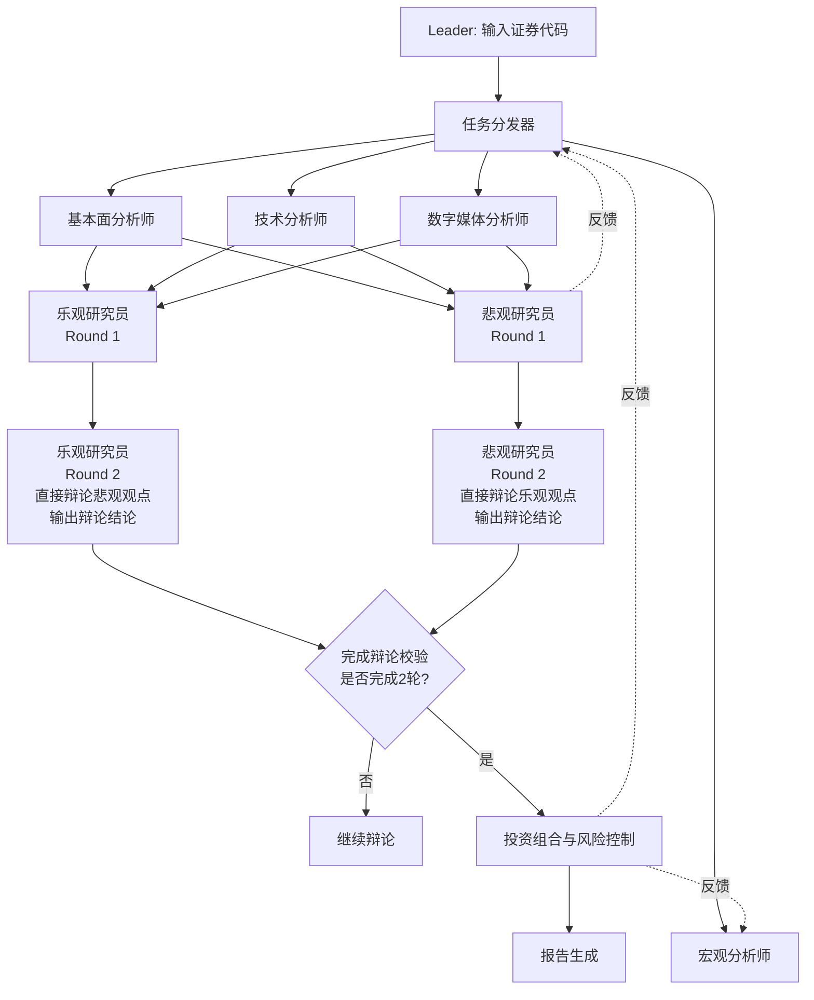

# Workflow: 投资分析团队协作流程（直接辩论版）

## Overview



这是一个 **Debate pattern (B+A+C)** 模式的团队技能：
- **B (并行分解)**：四个分析师并行工作，提高效率
- **A (对抗视角)**：乐观研究员 vs 悲观研究员的直接点对点辩论（固定2轮）
- **C (专业化流水线)**：质量门控（完成辩论）[SKILL.md](SKILL.md)

**关键改进**：
- 乐观研究员和悲观研究员并列获取三个分析师输入（基本面、技术、数字媒体）
- 直接点对点辩论机制（固定2轮，不允许提前终止）
- 研究员直接输出辩论结论（无需协调员转达）

- **Inter-member communication preference** (Debate pattern): this Teamskill declares **who sees whose output at which phase** (visibility semantics). Frameworks MUST implement **direct peer-to-peer exchange** for debate rounds (Round 2-3) — researchers communicate directly without coordinator relay. Priority: **(1) direct peer-to-peer exchange** (mandatory for debate) > **(2) shared blackboard** > **(3) Leader-relay** (fallback). See [bind.md](bind.md) § Behavioral Constraints for phase-scoped visibility rules.

## Detailed Steps

### Step 0 — Pre-flight: dependency check

- **Executor**: Leader
- **Input**: [dependencies.yaml](dependencies.yaml)
- **Action**: 验证所有依赖的技能和工具是否可用
- **Output**: 预检报告给用户
- **Quality gate**: 用户决定是否继续（Agent 不自动决定）

### Step 1 — 任务分发

- **Executor**: Leader (任务分发器角色)
- **Input**: 证券代码、公司名称、行业信息
- **Action**: 将任务并行分发给四个分析师
- **Output**: 任务分发确认
- **Serial / Parallel**: 并行分发
- **Quality gate**: 所有分析师确认接收任务，否则重新分发

### Step 2 — 四分析师并行分析

- **Executor**: 基本面分析师、技术分析师、数字媒体分析师、宏观分析师
- **Input**: 各分析师接收相应的数据输入
- **Action**: 
  - 基本面分析师：财务报表分析、盈利能力评估、竞争优势分析
  - 技术分析师：价格走势分析、技术指标应用、关键价位识别
  - 数字媒体分析师：社交媒体舆情分析、热点话题识别、异常信号检测
  - 宏观分析师：宏观经济环境分析、货币政策影响、系统性风险评估
- **Output**: 四份结构化分析报告
- **Serial / Parallel**: 并行执行
- **Quality gate**: 
  - 每份报告必须包含至少3个关键发现
  - 报告格式符合 Output Schema
  - 失败处理：重新分发任务给该分析师，最多重试2次

### Step 3 — 研究员观点整合（Round 1）

- **Executor**: 乐观研究员、悲观研究员
- **Input**: 
  - 乐观研究员：基本面、技术、数字媒体分析师报告
  - 悲观研究员：基本面、技术、数字媒体分析师报告（并列获取相同输入）
- **Action**: 
  - 乐观研究员：整合正面观点，识别投资机会和正面催化剂，准备辩论辩护
  - 悲观研究员：整合负面观点，识别潜在风险和负面因素，准备辩论辩护
- **Output**: 两份结构化研究报告（包含辩论辩护准备）
- **Serial / Parallel**: 并行执行（彼此不可见）
- **Quality gate**: 
  - 每份报告必须包含至少2个关键观点
  - 每份报告必须包含辩论辩护准备
  - 报告格式符合 Output Schema
  - 失败处理：重新分发任务给该研究员，最多重试2次

### Step 4 — 直接点对点辩论（Round 2）

- **Executor**: 乐观研究员、悲观研究员
- **Input**: 
  - 乐观研究员：悲观研究员的报告（直接可见，无需协调员转达）
  - 悲观研究员：乐观研究员的报告（直接可见，无需协调员转达）
- **Action**: 
  - **Round 2**: 
    - 乐观研究员：直接反驳悲观观点，辩护乐观立场，提出新证据，输出辩论结论（分歧点、共识点、论据强度评估）
    - 悲观研究员：直接反驳乐观观点，辩护悲观立场，提出新证据，输出辩论结论（分歧点、共识点、论据强度评估）
- **Output**: 两份辩论报告（包含反驳论据、新证据和辩论结论）
- **Serial / Parallel**: 并行执行（彼此直接可见对方观点）
- **Quality gate**: 
  - 每份辩论报告必须包含至少2个反驳论据
  - 每份辩论报告必须包含新证据支撑
  - 每份辩论报告必须包含辩论结论（分歧点、共识点、论据强度评估）
  - 辩论必须完成2轮，不允许提前终止
  - 失败处理：继续下一轮辩论，必须完成2轮

### Step 5 — 完成辩论校验

- **Executor**: Leader
- **Input**: 乐观研究员和悲观研究员的辩论报告（所有2轮）
- **Action**: 验证辩论是否充分、是否完成2轮
- **Output**: 完成辩论判断（是/否）
- **Serial / Parallel**: 串行执行
- **Quality gate**: 
  - 辩论覆盖所有关键分歧点
  - 双方论据充分且有证据支撑
  - 明确共识点或分歧点
  - 辩论完成2轮
  - 失败处理：继续辩论，必须完成2轮

### Step 6 — 投资组合与风险控制

- **Executor**: 投资组合与风险控制
- **Input**: 研究员输出的辩论结论、投资目标、风险承受能力
- **Action**: 构建投资组合建议、制定风险控制策略、提出最终决策
- **Output**: 投资决策报告
- **Serial / Parallel**: 串行执行
- **Quality gate**: 
  - 包含具体的仓位建议和配置策略
  - 包含至少3个风险控制措施
  - 包含监控指标和调整触发条件
  - 失败处理：重新构建投资组合建议，最多重试2次

### Step 7 — Final: emit 投资分析报告

- **Executor**: Leader
- **Input**: 所有上游步骤的输出（完整原始报告）
- **Action**: 整合所有分析结果，生成最终投资分析报告。**关键要求**: 将所有中间过程的完整报告作为原文引用插入最终报告，而非仅提供摘要。具体包括：
  - 四个分析师的完整原始报告（基本面、技术、数字媒体、宏观）
  - 乐观研究员和悲观研究员的 Round 1 完整报告
  - Round 2 和 Round 3 的完整辩论报告
  - 研究员输出的完整辩论结论
  - 投资组合与风险控制的完整决策报告
  - 报告生成元数据和质量门控记录
- **Output**: 投资分析报告（包含所有中间过程的完整原文引用，确保透明性和可追溯性）

#### Final Report Format

**重要变更**: 最终报告必须将所有中间过程的完整报告作为原文引用插入，而非仅提供摘要。这确保了分析过程的完整透明性和可追溯性。

```markdown
# 投资分析报告

## 证券信息
- 证券代码: [代码]
- 公司名称: [名称]
- 行业: [行业]
- 分析日期: [日期]

---

## 第一部分：分析师完整报告（原文引用）

> **说明**: 以下为四个分析师的完整分析报告原文，未经修改或摘要。

### 1. 基本面分析师完整报告

> **原文引用 - 基本面分析师**
> 
> [完整粘贴基本面分析师的原始输出报告，包括所有章节、数据、分析和结论]

---

### 2. 技术分析师完整报告

> **原文引用 - 技术分析师**
> 
> [完整粘贴技术分析师的原始输出报告，包括所有章节、图表分析、技术指标和交易建议]

---

### 3. 数字媒体分析师完整报告

> **原文引用 - 数字媒体分析师**
> 
> [完整粘贴数字媒体分析师的原始输出报告，包括所有章节、舆情数据、热点分析和风险评估]

---

### 4. 宏观分析师完整报告

> **原文引用 - 宏观分析师**
> 
> [完整粘贴宏观分析师的原始输出报告，包括所有章节、宏观经济数据、政策分析和系统性风险评估]

---

## 第二部分：研究员初始观点（Round 1 完整报告原文引用）

> **说明**: 以下为乐观研究员和悲观研究员在 Round 1 的完整研究报告原文，彼此独立生成。

### 1. 乐观研究员 Round 1 完整报告

> **原文引用 - 乐观研究员 Round 1**
> 
> [完整粘贴乐观研究员的 Round 1 原始输出报告，包括所有章节、投资机会分析、正面催化剂和辩论辩护准备]

---

### 2. 悲观研究员 Round 1 完整报告

> **原文引用 - 悲观研究员 Round 1**
> 
> [完整粘贴悲观研究员的 Round 1 原始输出报告，包括所有章节、风险识别、负面因素分析和辩论辩护准备]

---

## 第三部分：直接点对点辩论过程（Round 2 完整报告原文引用）

> **说明**: 以下为乐观研究员和悲观研究员在 Round 2 的完整辩论报告原文，展示直接点对点辩论的全过程。

### Round 2 辩论完整报告

#### 乐观研究员 Round 2 完整辩论报告

> **原文引用 - 乐观研究员 Round 2**
> 
> [完整粘贴乐观研究员的 Round 2 原始输出报告，包括所有反驳论据、新证据支撑和辩护立场]

---

#### 悲观研究员 Round 2 完整辩论报告

> **原文引用 - 悲观研究员 Round 2**
> 
> [完整粘贴悲观研究员的 Round 2 原始输出报告，包括所有反驳论据、新证据支撑和辩护立场]

---

## 第四部分：辩论结论（研究员直接输出原文引用）

> **说明**: 以下为研究员在辩论结束后直接输出的辩论结论原文。

### 乐观研究员辩论结论

> **原文引用 - 乐观研究员辩论结论**
> 
> [完整粘贴乐观研究员输出的辩论结论，包括分歧点、共识点、论据强度评估和平衡决策建议]

---

### 悲观研究员辩论结论

> **原文引用 - 悲观研究员辩论结论**
> 
> [完整粘贴悲观研究员输出的辩论结论，包括分歧点、共识点、论据强度评估和平衡决策建议]

---

## 第五部分：最终投资决策（完整报告原文引用）

> **说明**: 以下为投资组合与风险控制角色的完整决策报告原文。

### 投资组合与风险控制完整报告

> **原文引用 - 投资组合与风险控制**
> 
> [完整粘贴投资组合与风险控制的原始输出报告，包括所有章节：投资组合建议、风险控制策略、监控指标和执行建议]

---

## 第六部分：报告生成元数据

### 报告生成信息
- 报告生成时间: [时间戳]
- 总辩论轮次: 2轮（固定）
- 完成辩论校验: [通过]
- 质量门控状态: [所有门控通过/部分门控失败记录]

### 角色执行状态
| 角色 | 执行状态 | 重试次数 | Token消耗 | 时间消耗 |
|---|---|---|---|---|
| 基本面分析师 | [成功/失败] | [次数] | [tokens] | [分钟] |
| 技术分析师 | [成功/失败] | [次数] | [tokens] | [分钟] |
| 数字媒体分析师 | [成功/失败] | [次数] | [tokens] | [分钟] |
| 宏观分析师 | [成功/失败] | [次数] | [tokens] | [分钟] |
| 乐观研究员 | [成功/失败] | [次数] | [tokens] | [分钟] |
| 悲观研究员 | [成功/失败] | [次数] | [tokens] | [分钟] |
| 投资组合与风险控制 | [成功/失败] | [次数] | [tokens] | [分钟] |

### 质量门控记录
- [记录所有质量门控的检查结果，包括通过/失败原因和处理方式]

---

## 附录：报告结构说明

本报告采用**原文引用模式**，将所有中间过程的完整报告直接插入最终报告，而非仅提供摘要。这种模式确保：

1. **完整透明性**: 所有分析过程和论据完整可见
2. **可追溯性**: 每个结论都可追溯到原始分析报告
3. **辩论真实性**: 辩论过程完整记录，无编辑或摘要
4. **决策依据清晰**: 最终决策基于完整的辩论结论和分析报告

报告结构遵循 Debate pattern (B+A+C) 的设计原则：
- **B (并行分解)**: 四个分析师并行工作，完整报告独立呈现
- **A (对抗视角)**: 乐观研究员 vs 悲观研究员的直接点对点辩论，完整辩论过程原文引用
- **C (专业化流水线)**: 质量门控确保每个阶段的输出质量，门控记录完整呈现
```

## Acceptance Criteria

- 所有分析师返回符合 Output Schema 的报告（无格式错误）
- 所有研究员返回符合 Output Schema 的报告（包含辩论辩护准备）
- 直接点对点辩论必须完成2轮
- 完成辩论校验通过（明确共识点或分歧点）
- 研究员输出辩论结论（包含至少3个分歧点或共识点）
- 投资组合与风险控制包含至少3个风险控制措施
- 最终投资分析报告包含所有必要章节（包含2轮辩论过程和辩论结论）
- 所有质量门控通过或明确记录失败原因和处理方式