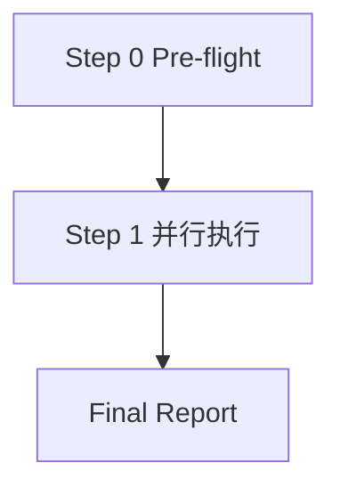

# Workflow: 开发-测试并行团队

## 流程图



## Step 0: Pre-flight 依赖检查

- **Executor**: leader
- **Action**: 读取 [dependencies.yaml](dependencies.yaml)，验证 python3 可用
- **Output**: 报告依赖状态；python3 缺失则终止（required: true）
- **Quality Gate**: python3 可用，用户确认继续

## Step 1: 并行执行

- **Executor**: developer + tester（并行 spawn）
- **Input**: 用户功能描述
- **Output**:
  - developer → `.team/reports/T1_developer.md`
  - tester → `.team/reports/T2_tester.md`
- **Visibility**: developer 和 tester 彼此不可见（并行分解模式）
- **Quality Gate**: 两份文件都存在且含完整代码块

## Final Report

leader 把两份输出以**原文引用**形式整合到 `.team/reports/T3_final_report.md`：

```markdown
# 开发-测试并行团队 最终报告

## 开发者输出
<原样引用 .team/reports/T1_developer.md 的内容>

## 测试工程师输出
<原样引用 .team/reports/T2_tester.md 的内容>

## 整合说明
- 代码与测试的对应关系
- 建议的下一步（如运行测试、修复失败用例）
```
