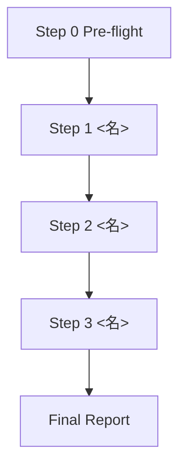

# Workflow: <团队名>

## 流程图



## Step 0: Pre-flight 依赖检查

- **Executor**: leader
- **Action**: 读取 dependencies.yaml，验证依赖可用性
- **Output**: 报告缺失项；required=true 缺失则终止，required=false 缺失则降级
- **Quality Gate**: 用户确认是否继续

## Step 1: <步骤名>

- **Executor**: <leader / role-name>
- **Input**: <输入来源>
- **Output**: <输出文件路径>
- **Quality Gate**: <完成校验标准>

## Step 2: <步骤名>

- **Executor**: <role-name>
- **Input**: <上游输出 / 用户输入>
- **Output**: <输出文件路径>
- **Quality Gate**: <完成校验标准>

## Final Report

leader 把所有中间报告以**原文引用**形式整合到 `.team/reports/T<最后>_final_report.md`，模板：

```markdown
# <团队名> 最终报告

## 各角色输出原文

### <role-1> 报告
<原样引用 .team/reports/T*_*.md 的内容>

### <role-2> 报告
<原样引用>
```
